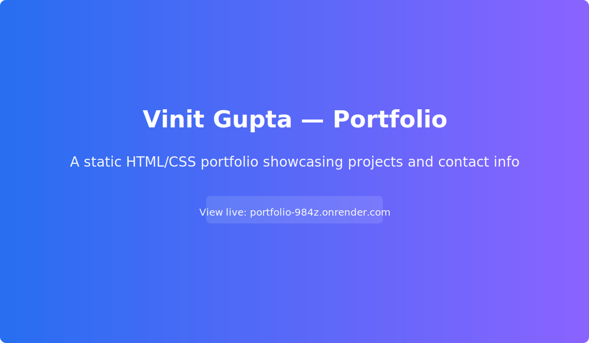

# Vinit Gupta — Portfolio

Live demo: https://portfolio-984z.onrender.com/

Brief
-----

This repository contains my personal portfolio website showcasing projects, skills, and contact details. The site is a static HTML/CSS project designed for quick deployment and easy local preview.

Demo
----

- Live: https://portfolio-984z.onrender.com/
 - Live: https://portfolio-984z.onrender.com/

Features
--------

- Clean responsive layout
- Project gallery with descriptions and links
- Contact / hire section
- Fast static delivery (no backend required)

Tech
----

- HTML5, CSS3
- Deployed on Render

Quick start
-----------

1. Clone the repo:

	git clone https://github.com/vinitguptaa/Portfolio.git

2. Open locally: double-click `index.html` or run a simple HTTP server:

	python -m http.server 8000

	Then open http://localhost:8000 in your browser.

Usage
-----

- Edit content in `index.html` and update assets in the `assets/` folder.

Deployment
----------

This project is deployed on Render:

https://portfolio-984z.onrender.com/

Contributing
------------

Contributions are welcome. Please fork the repo, create a feature branch, and open a pull request. Keep changes small and include screenshots for UI updates.

License
-------

This project does not include a license file. Add a `LICENSE` if you want to specify reuse terms (MIT is common for portfolio sites).

Contact
-------

- GitHub: https://github.com/vinitguptaa
- Live site: https://portfolio-984z.onrender.com/

--
Deployed on Render: https://portfolio-984z.onrender.com/
